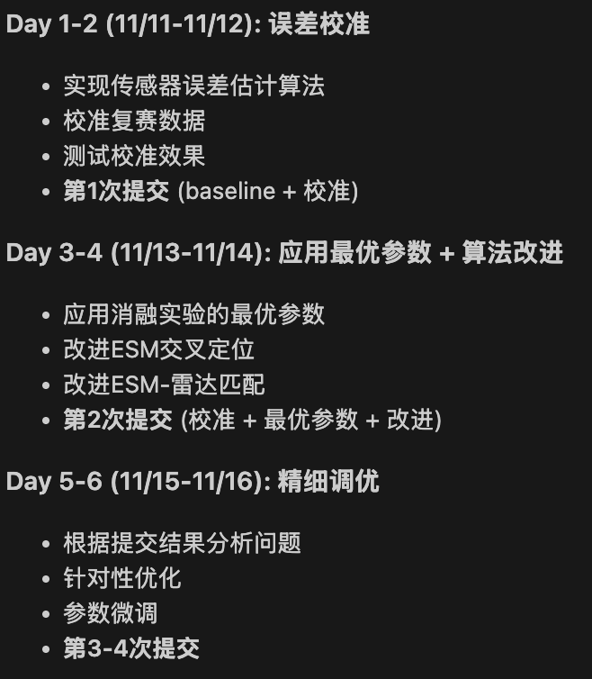

# 稀疏侦测与误差干扰下的多目标航迹重建（复赛）

## 项目说明
稀疏侦测与误差干扰下的多目标航迹重建（复赛）

## 项目结构
```
trajectory/
├── official/              # 官方数据和工具（包含复赛）
├── our_ans/               # 实验代码
├── ──20_ans/              # 参考方案代码
├── common/                # 公共模块
└── methods/               # 各方案实现
```

## 团队成员
- 管理：
- 开发：[@chenjiarui123](https://github.com/chenjiarui123)
- 开发：

## 方案

### 基线方案（不校准，47分）

- 第一版直接复现参考方案，未做校准和改动，跑通流程作为起点。
- 运行 `methods/run_baseline.py` 可以得到官方47分。

### 复赛优化方案对比

| 维度 | 方案1: 保守优化 | 方案2: 中度优化 | 方案3: 激进优化 |
|------|----------------|----------------|----------------|
| **预处理** | ✅ 完全复用20_ans | ✅ 复用+微调参数 | ⚠️ 部分重写 |
| **误差处理** | ❌ 不处理 | ✅ 优先5号ESM | ✅ 完整校准 |
| **轨迹重建** | 🔧 改进插值参数 | 🔧 卡尔曼滤波 | 🔧 深度学习/多目标跟踪 |
| **工作量** | 1天 | 2-3天 | 4-5天 |
| **风险** | 低 | 中 | 高 |
| **预期提升** | +2-4分 | +4-8分 | +5-15分（不确定） |

**说明：**
- 方案1：微调参数，改进插值，风险最低
- 方案2：引入卡尔曼滤波，优先使用5号ESM，性价比最高
- 方案3：深度学习或多目标跟踪，需要大量开发，不确定性高

**建议执行顺序：** 方案1 → 方案2 → 方案3


